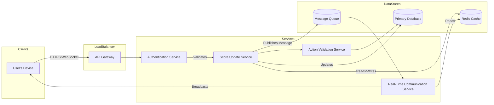
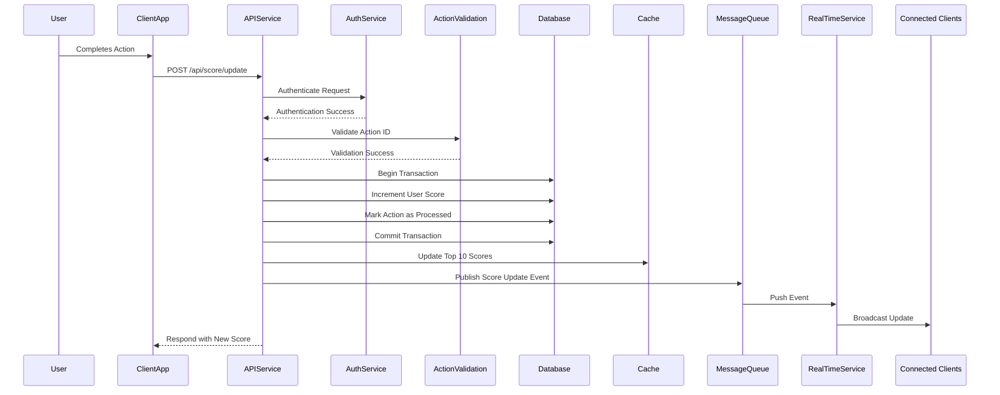

Sure! Here's your updated document with an index added to each section. You can click on the index to navigate directly to the desired section.

---

# Score Update Module Design Documentation

## Table of Contents
1. [Introduction](#introduction)
2. [System Design Overview](#system-design-overview)
   - [High-Level Architecture](#high-level-architecture)
   - [Key Components and Tech Stacks](#key-components-and-tech-stacks)
   - [System Interaction Flow](#system-interaction-flow)
3. [Real-Time Architecture Details](#real-time-architecture-details)
   - [Real-Time Communication Service](#real-time-communication-service)
   - [WebSocket Infrastructure](#websocket-infrastructure)
   - [Message Flow](#message-flow)
   - [Ensuring Consistency](#ensuring-consistency)
   - [Data Synchronization and Caching](#data-synchronization-and-caching)
   - [High Availability and Fault Tolerance](#high-availability-and-fault-tolerance)
4. [System Design Diagrams](#system-design-diagrams)
   - [Component Interaction Diagram](#component-interaction-diagram)
   - [Sequence Diagram](#sequence-diagram)
5. [Detailed Component Descriptions](#detailed-component-descriptions)
   - [Client Applications](#client-applications)
   - [API Gateway](#api-gateway)
   - [Authentication Service](#authentication-service)
   - [Score Update Service](#score-update-service)
   - [Action Validation Service](#action-validation-service)
   - [Real-Time Communication Service](#real-time-communication-service)
   - [Data Storage](#data-storage)
   - [Message Queue System](#message-queue-system)
6. [Implementation Details](#implementation-details)
   - [API Endpoint](#api-endpoint)
   - [Authentication and Authorization](#authentication-and-authorization)
   - [Action Validation](#action-validation)
   - [Score Management](#score-management)
   - [Real-Time Communication](#real-time-communication)
   - [Data Storage](#data-storage-1)
7. [Additional Considerations](#additional-considerations)
   - [Security Enhancements](#security-enhancements)
   - [Scalability Strategies](#scalability-strategies)
   - [Monitoring and Logging](#monitoring-and-logging)
8. [Conclusion](#conclusion)
9. [Appendix: Data Structures](#appendix-data-structures)

---

## 1. [Introduction](#introduction)

The Score Update Module is responsible for securely handling user score increments and ensuring that the scoreboard updates in real-time across all connected clients. This document outlines the comprehensive system design, with a focus on the real-time architecture, followed by detailed implementation guidelines. The goal is to provide a clear understanding of how the module operates and interacts with other system components, enabling seamless scalability, maintainability, and high performance.

---

## 2. [System Design Overview](#system-design-overview)

### 2.1 [High-Level Architecture](#high-level-architecture)

At its core, the Score Update Module operates within a distributed system, consisting of several interconnected components to handle user interactions, data processing, and real-time communication. The architecture is designed to be robust, scalable, and secure, ensuring that the system can handle high volumes of concurrent requests while maintaining data integrity and providing instant feedback to users.

### 2.2 [Key Components and Tech Stacks](#key-components-and-tech-stacks)

1. **Client Applications**
   - Web Browsers
   - Mobile Apps
   - Other Connected Devices

2. **API Gateway (Or BFF)**
   - Load Balancer
   - Reverse Proxy

3. **Authentication Service**
   - Token Generation (JWT)
   - Authorization Checks

4. **Score Update Service (Synchronous communication)**
   - API Endpoint for Score Updates
   - Action Validation Logic
   - Score Management and Persistence

5. **Real-Time Communication Service (Asynchronous communication)**
   - WebSocket Servers
   - Event Broadcasting Mechanism

6. **Data Storage**
   - Primary Database (PostgreSQL)
   - In-Memory Cache (Redis)
   - Action Logs and Idempotency Keys

7. **Message Queue System**
   - Asynchronous Task Processing (RabbitMQ)

8. **Monitoring and Logging**
   - Performance Metrics (Sentry)
   - Error Tracking (Portainer)

### 2.3 [System Interaction Flow](#system-interaction-flow)

1. **User Action Initiation**
   - A user completes an action on the client application that should result in a score update.

2. **API Request Submission**
   - The client sends an authenticated `POST` request to the Score Update API endpoint with the `user_id` and `action_id`.

3. **Request Authentication and Authorization**
   - The API Gateway routes the request to the Score Update Service after passing through the Authentication Service for verification.

4. **Action Validation**
   - The Score Update Service validates the `action_id` to ensure it hasn't been processed before, preventing duplicate score increments.

5. **Score Update Processing**
   - Upon successful validation, the service increments the user's score in the database within a transactional operation to maintain data consistency.

6. **Real-Time Scoreboard Update**
   - If the updated score affects the top 10 leaderboard, the Real-Time Communication Service broadcasts the updated leaderboard to all connected clients via WebSockets.

7. **Response to Client**
   - The service responds to the originating client with a success message and the user's new score.

8. **Monitoring and Logging**
   - All operations are logged, and system metrics are updated for monitoring purposes.

---

## 3. [Real-Time Architecture Details](#real-time-architecture-details)

### 3.1 [Real-Time Communication Service](#real-time-communication-service)

#### Overview

The Real-Time Communication Service is responsible for pushing updates to clients instantaneously. By employing WebSockets, we establish a persistent connection between the server and the connected clients, enabling the server to send data to clients without explicit requests. This mechanism is crucial for keeping the scoreboard in sync across all users.

#### WebSocket Infrastructure

- **WebSocket Servers**: Deployed behind a load balancer to handle multiple connections efficiently.
- **Channels/Topics**: Clients subscribe to specific channels (e.g., `scoreboard_updates`) to receive relevant data.
- **Scalability**: Utilize a publish-subscribe pattern with a message broker to distribute messages across multiple WebSocket server instances.

#### Message Flow

1. **Event Trigger**: A score update qualifies for a leaderboard change.
2. **Message Publishing**: The Score Update Service publishes a message to the `scoreboard_updates` channel.
3. **Message Broadcasting**: The Real-Time Communication Service receives the message and broadcasts it to all subscribed clients.
4. **Client Update**: Clients receive the message and update their local scoreboard display accordingly.

#### Ensuring Consistency

- **Message Ordering**: Implement sequence numbers or timestamps to handle out-of-order messages.
- **Disconnection Handling**: Clients can resubscribe and sync missed messages upon reconnection.

### 3.2 [Data Synchronization and Caching](#data-synchronization-and-caching)

To handle frequent read operations for the top 10 leaderboard, we employ an in-memory caching system.

- **Cache Store**: Utilize Redis for its speed and support for data structures like sorted sets.
- **Leaderboard Maintenance**: Update the cache whenever a score that might affect the top 10 changes.
- **Cache Invalidation**: Implement strategies to invalidate and refresh the cache when necessary to ensure data accuracy.

### 3.3 [High Availability and Fault Tolerance](#high-availability-and-fault-tolerance)

- **Load Balancing**: Distribute client connections and API requests across multiple servers.
- **Auto-Scaling**: Automatically adjust the number of running instances based on the load.
- **Failover Mechanisms**: Detect server failures and reroute traffic to healthy instances.

---

## 4. [System Design Diagrams](#system-design-diagrams)

### 4.1 [Component Interaction Diagram](#component-interaction-diagram)



### 4.2 [Sequence Diagram](#sequence-diagram)



---

## 5. [Detailed Component Descriptions](#detailed-component-descriptions)

### 5.1 [Client Applications](#client-applications)

Clients can be web browsers, mobile apps, or any device capable of interacting with our platform's API and WebSocket services.

- **Responsibilities**:
  - Capture user actions and send requests to the server.
  - Establish and maintain WebSocket connections for real-time updates.
  - Update UI components (e.g., scoreboards) upon receiving new data.

### 5.2 [API Gateway](#api-gateway)

Acts as the entry point for all client requests.

- **Responsibilities**:
  - Route requests to appropriate backend services.
  - Implement SSL termination for secure connections.
  - Perform basic request logging and rate limiting.

### 5.3 [Authentication Service](#authentication-service)

Validates user credentials and permissions.

- **Responsibilities**:
  - Verify tokens provided in request headers (HTTP only cookies for stronger security).
  - Manage token issuance and revocation.
  - Integrate with user management systems for authentication data.

### 5.4 [Score Update Service](#score-update-service)

Handles incoming score update requests.

- **Responsibilities**:
  - Expose endpoints for score updates.
  - Coordinate with Action Validation to prevent duplicate processing.
  - Perform atomic score increments in the database.
  - Publish events when significant score changes occur.

### 5.5 [Action Validation Service](#action-validation-service)

Ensures that each action triggering a score update is legitimate and unique.

- **Responsibilities**:
  - Check if `action_id` has been processed.
  - Validate that the action is permissible for the `user_id`.
  - Maintain a log of processed actions for idempotency.

### 5.6 [Real-Time Communication Service](#real-time-communication-service)

Manages real-time data flow to clients.

- **Responsibilities**:
  - Handle WebSocket connections.
  - Subscribe to message queues for events.
  - Broadcast messages to connected clients.

### 5.7 [Data Storage](#data-storage)

#### Primary Database

Stores persistent data securely.

- **Responsibilities**:
  - Maintain user profiles, scores, and action logs.
  - Support transactions for data integrity.
  - Ensure high availability and consistency.

#### In-Memory Cache

Used for rapid data retrieval.

- **Responsibilities**:
  - Store frequently accessed data like the top 10 leaderboard.
  - Reduce load on the primary database.
  - Support atomic operations for data consistency.

### 5.8 [Message Queue System](#message-queue-system)

Facilitates asynchronous communication between services.

- **Responsibilities**:
  - Decouple services to improve scalability.
  - Handle event-driven messaging for real-time updates.
  - Ensure message delivery even under high load.

---

## 6. [Implementation Details](#implementation-details)

### 6.1 [API Endpoint](#api-endpoint)

#### `POST /api/score/update`

Handles score updates when users complete actions.

**Headers**

- `Content-Type: application/json`
- `Authorization: Bearer <token>`

**Request Body**

```json
{
  "user_id": "string",
  "action_id": "string"
}
```

**Response**

- **Success (200 OK)**

  ```json
  {
    "message": "Score updated successfully.",
    "new_score": integer
  }
  ```

- **Failure**
  - `400 Bad Request`: Invalid parameters.
  - `401 Unauthorized`: Authentication failed.
  - `403 Forbidden`: Action not permitted.
  - `409 Conflict`: Duplicate action.
  - `500 Internal Server Error`: Server error.

### 6.2 [Authentication and Authorization](#authentication-and-authorization)

- Implement token-based authentication using JWT.
- Use middleware to enforce authentication on protected endpoints.
- Validate permissions associated with the user roles.

### 6.3 [Action Validation](#action-validation)

- Store `action_id`s in a dedicated table with a unique constraint.
- Use database transactions to prevent race conditions when checking and inserting new `action_id`s.

### 6.4 [Score Management](#score-management)

- Apply atomic operations to increment scores.
- Use database-level transactions to ensure consistency.
- Implement retries in the case of transient failures.

### 6.5 [Real-Time Communication](#real-time-communication)

- Set up WebSocket servers and manage client connections.
- Use a message broker (Redis Pub/Sub) to publish and subscribe to events.
- Ensure messages are serialized in a format compatible with clients.

### 6.6 [Data Storage](#data-storage-1)

- Optimize database schema with appropriate indexing on frequently queried fields.
- Regularly back up the database and test restore procedures.
- Use Redis sorted sets for efficient leaderboard management.

---

## 7. [Additional Considerations](#additional-considerations)

### 7.1 [Security Enhancements](#security-enhancements)

- **Rate Limiting**: Implement to protect against abuse.
- **Data Encryption**: Use HTTPS and TLS for all data in transit.
- **Input Validation**: Sanitize all inputs to prevent injection attacks.
- **Monitoring**: Set up intrusion detection systems.

### 7.2 [Scalability Strategies](#scalability-strategies)

- **Load Balancing**: Distribute traffic using NGINX.
- **Horizontal Scaling**: Add more instances of services as load increases.
- **Database Replication**: Use master-slave configurations to distribute read operations.

### 7.3 [Monitoring and Logging](#monitoring-and-logging)

- **Centralized Logging**: Use AWS CloudWatch for log aggregation and retention.
- **Performance Monitoring**: Implement Portainer for container insights and CloudWatch for infrastructure metrics.
- **Alerting**: Configure CloudWatch Alarms for critical thresholds (high CPU, error rates, container restarts).

---

## 8. [Conclusion](#conclusion)

The Score Update Module is designed with a focus on security, real-time responsiveness, and scalability. The components maintain a lightweight architecture and cost-efficient operation to serve as an MVP. While the system remains lightweight, it retains significant room for improvement and maintenance without introducing complexity overhead, as services are decomposed into smaller, independently deployable units.

---

## 9. [Appendix: Data Structures](#appendix-data-structures)

### User Score Table (Database)

| Column      | Type        | Constraints          |
|-------------|-------------|----------------------|
| user_id     | UUID        | Primary Key          |
| score       | Integer     | Default: 0           |
| created_at  | Timestamp   | Default: 0           |
| updated_at  | Timestamp   | Default: 0           |

### Action Log Table (Database)

| Column      | Type      | Constraints                   |
|-------------|-----------|-------------------------------|
| action_id   | UUID      | Primary Key                   |
| user_id     | UUID      | Foreign Key (User Score Table)|
| timestamp   | Timestamp |                               |
| created_at  | Timestamp | Default: 0                    |
| updated_at  | Timestamp | Default: 0                    |

### Redis Cache Structure

- **Key**: `leaderboard`
- **Type**: Sorted Set
- **Members**: `user_id`
- **Scores**: `score`

